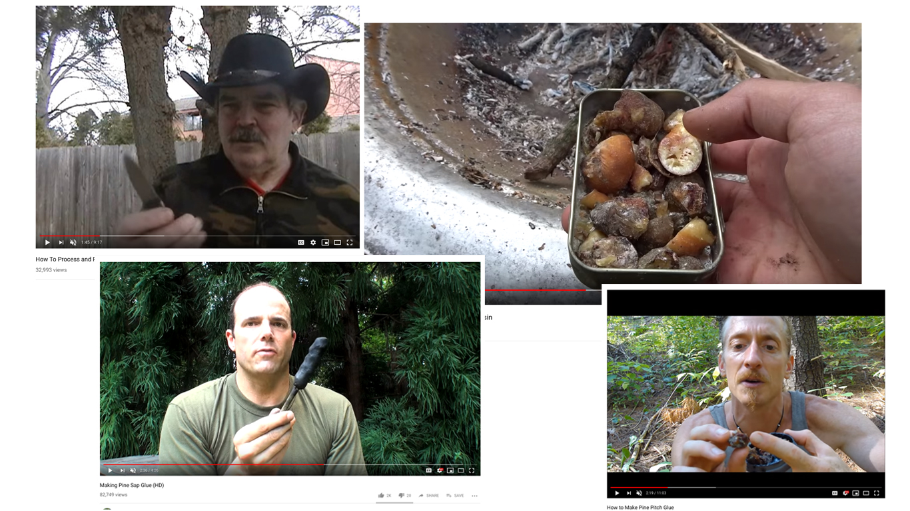

# Experimenting with pine resin

## Pine sap glue - it's a survival thing

Sources (from top left): [1](https://www.youtube.com/watch?v=XOxwFwahpwg), [2](https://www.youtube.com/watch?v=Ay5l-gyx2IQ), [3](https://www.youtube.com/watch?v=M-FksxvtyiQ), [4](https://www.youtube.com/watch?v=8R4yExwKhS4)

[*16 Uses of Sticky Pine Sap for Wilderness Survival and Self-Reliance*](https://survivalsherpa.wordpress.com/2015/02/05/16-uses-of-sticky-pine-sap-for-wilderness-survival-and-self-reliance/)

## Collecting the resin

## Testing different mixtures

| Sample number | resin contents | addition                      | comments                                   |
| ------------- | -------------- | ----------------------------- | ------------------------------------------ |
| 1             | 20,68 g        | 5,02 g coal ash               |                                            |
| 2             | 20,98 g        | 10,02 g coal ash              |                                            |
| 3             | 22,58 g        | 15 g coal ash                 |                                            |
| 4             | 20,7 g         | 10,10 g used coffee grounds   |                                            |
| 5             | 21,17 g        | 6,52 g powdered orange peel   | beutiful colors and aromas                 |
| 6             | 20,22 g        | 1,63 g  powdered palm ligamen |                                            |
| 7             | 21,36 g        | 1 g powdered bamboo fiber     | quick absorption                           |
| 8             | 21,22 g        | 9,02 g powdered bone calcium  | quick and intense reaction                 |
| 9             | 21,82 g        | 2,1 g silica                  | slow absorbption, intense initial reaction |
| 10            | 21 g           | 4,09 processed malt           |                                            |

